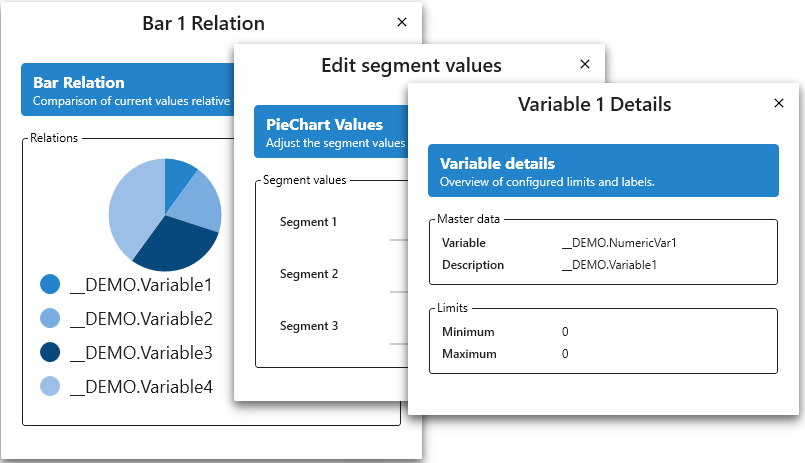

<!-- Readme for VisiWin-74-ModernUI-Popover -->
# VisiWin-74-ModernUI-Popover

This is the **example/development project** demonstrating how to implement a "Popover" style navigation user interface using VisiWin 7 ModernUI (WPF) technology. It showcases how to use Navigation Containers to dynamically load styled views into specific regions, creating a clean, modern dashboard or details-pane experience.

The project serves as a reference for structuring complex UI layouts where content needs to be presented in a decoupled, overlay-like, or distinct "popover" manner relative to the main navigation interactions.

[](https://www.inosoft.com/)


[](LICENSE)




## Related packages

- VisiWin 7 Runtime 7.4
- VisiWin 7 IDE
- .NET Framework 4.8
- WPF (Windows Presentation Foundation)

## Prerequisites

- **VisiWin 7 IDE** - Install VisiWin 7 IDE (version 2025-1 or later recommended)
- **Visual Studio 2019/2022** - For development and compilation
- **.NET Framework 4.8** - Target framework for all projects
- **VisiWin 7 Runtime 7.4** - Required for testing and deployment

## Solution Structure

This repository contains two main projects that work together to provide the complete sample:

### [VisiWin-74-ModernUI-Popover_Client](VisiWin-74-ModernUI-Popover_Client/)

The **client application** containing the User Interface and logic.

- **Purpose**: Defines the visual layout, styles, and navigation structure.
- **Key Components**:
  - `Views/MainRegion/PopoverNavigationView.xaml` — The main layout container hosting the navigation bars and the target region.
  - `Resources/PopoverStyles.xaml` — Centralized styles defining the visual look of "Popover" elements (Margins, Headers, GroupBoxes).
  - `Views/MainRegion/Popover/` — Contains the specific views loaded as popovers (e.g., `VarOutSampleView`, `BarSampleView`).
  - `App.xaml` — Application entry point and resource merging.

### [VisiWin-74-ModernUI-Popover_Server](VisiWin-74-ModernUI-Popover_Server/)

The **server application** handling the backend runtime.

- **Purpose**: Provides the VisiWin runtime environment, variable management, and alarm handling.
- **Key Components**:
  - `VisiWin-74-ModernUI-Popover_Server.vw7` — Main VisiWin configuration file.
  - `Data/` — Contains Archive and Log configuration.

## Getting started

### Basic Usage

1.  **Open the solution** `VisiWin-74-ModernUI-Popover.sln` in Visual Studio or VisiWin 7 IDE.
2.  **Restore Nuget Packages** (if applicable) and Build the solution.
3.  **Start the Project** by running the client executables.

The application will launch `PopoverNavigationView`. You will see:
- A **Left Navigation Bar** (Global samples like Bar, Pie Chart).
- A **Right Navigation Bar** (Inline samples like Additional Help).
- A **Central Region** (`PopoverDemoRegion`) where the selected views apppear.

### Creating a Custom Popover View

1.  **Define the View**: Create a new UserControl or View in your project (e.g., `MyCustomPopoverView.xaml`).
2.  **Apply Styles**: Use the resources defined in `PopoverStyles.xaml` to ensure your view matches the application theme.

```xml
<vw:View x:Class="HMI.Views.MyCustomPopoverView" ... >
    <Grid Style="{StaticResource PopoverRootGrid}">
        <Grid.RowDefinitions>
            <RowDefinition Height="Auto"/>
            <RowDefinition Height="*"/>
        </Grid.RowDefinitions>

        <!-- Header -->
        <Border Grid.Row="0" Style="{StaticResource PopoverHeaderBand}">
            <StackPanel>
                <TextBlock Text="My Custom Title" Style="{StaticResource PopoverHeaderTitle}"/>
                <TextBlock Text="Subtitle description" Style="{StaticResource PopoverHeaderSubtitle}"/>
            </StackPanel>
        </Border>

        <!-- Content -->
        <GroupBox Grid.Row="1" Header="Details" Style="{StaticResource PopoverSectionGroupBox}">
           <StackPanel>
               <TextBlock Text="Content goes here..." Style="{StaticResource PopoverBodyText}"/>
           </StackPanel>
        </GroupBox>
    </Grid>
</vw:View>
```

3.  **Register Navigation**: Add an item to the `NavigationContainer` in `PopoverNavigationView.xaml` pointing to your new view.

```xml
<vw:NavigationContainerItem LocalizableText="@MyCustomText" 
                            ViewName="MyCustomPopoverView"
                            RegionName="PopoverDemoRegion"/>
```

## Popover Implementation Guide

### Navigation Architecture

The core of the sample uses the `NavigationContainer` control to drive content into a specific named region.

- **Source**: `NavigationContainer` (Left or Right dock).
- **Trigger**: `NavigationContainerItem` click.
- **Target**: `vw:Region` with `x:Name="PopoverDemoRegion"`.

```xml
<!-- Source Navigation -->
<vw:NavigationContainer ...>
    <vw:NavigationContainer.Items>
         <vw:NavigationContainerItem ViewName="TargetViewName" RegionName="PopoverDemoRegion" .../>
    </vw:NavigationContainer.Items>
</vw:NavigationContainer>

<!-- Target Region -->
<vw:Region x:Name="PopoverDemoRegion" ... />
```

### Styling System

The consistent look and feel is achieved through `Resources/PopoverStyles.xaml`. This dictionary allows you to decouple the visual design from the structural xaml.

**Key Styles:**

| Style Key | Target Type | Usage |
|-----------|-------------|-------|
| `PopoverRootGrid` | `Grid` | Main container margin and layout |
| `PopoverHeaderBand` | `Border` | Colored header bar background |
| `PopoverHeaderTitle` | `TextBlock` | Primary title text |
| `PopoverSectionGroupBox` | `GroupBox` | Container for grouped content sections |
| `PopoverBodyText` | `TextBlock` | Standard content text |

**Example - Consuming Styles:**
Ensure `PopoverStyles.xaml` is merged in `App.xaml` or your local view resources.

```xml
<ResourceDictionary.MergedDictionaries>
    <ResourceDictionary Source="/Resources/PopoverStyles.xaml"/>
</ResourceDictionary.MergedDictionaries>
```

## Popover Scenarios & Configuration details

The sample project demonstrates three distinct scenarios for using Popovers, highlighting the flexibility of the `PopoverAction`, `PopoverPanel`, and `Popover` control.

### 1. Global / Unconstrained Popover (Action + ViewName)
*   **Use Case:** Standard "Popup" behavior where the view opens on top of everything (or in the default window layer) near the triggering element.
*   **Key Components:** `vw:PopoverAction`.
*   **Configuration:**
    *   Set `PopoverViewName` to the name of the View to be loaded.
    *   Do **not** set `PopoverPanelName` (uses default behavior).
    *   Use `Placement` (Left, Right, Top, Bottom) and `Alignment` (OnElement) to position relative to the clicked control.

**Example (`BarSampleView.xaml`):**
```xml
<vw:Bar ...>
    <i:Interaction.Triggers>
        <i:EventTrigger EventName="PreviewMouseDown">
            <!-- Loads "BarPopoverView" globally aligned to the Bar control -->
            <vw:PopoverAction PopoverViewName="BarPopoverView"
                              Title="Details"
                              Placement="Left"
                              Alignment="OnElement"/>
        </i:EventTrigger>
    </i:Interaction.Triggers>
</vw:Bar>
```

### 2. Panel-Constrained Popover (Action + ViewName + Panel)
*   **Use Case:** You want the popover to appear **inside** a specific area of your view, rather than floating over the entire window. Useful for "Inline" help or context menus that shouldn't obscure navigation.
*   **Key Components:** `vw:PopoverAction`, `vw:PopoverPanel`.
*   **Configuration:**
    *   Place a `vw:PopoverPanel` in your XAML layout where you want the popover to appear.
    *   In the Action, set `PopoverPanelName` to match the `x:Name` of that panel.

**Example (`AdditionalHelpSampleView.xaml`):**
```xml
<Grid>
    <!-- 1. The Trigger -->
    <vw:SymbolPresenter ...>
        <i:Interaction.Triggers>
            <i:EventTrigger EventName="PreviewMouseDown">
                <!-- Loads view into "AdditionalHelpPanel" -->
                <vw:PopoverAction PopoverViewName="AdditionalHelpPopoverView"
                                  PopoverPanelName="AdditionalHelpPanel" ... />
            </i:EventTrigger>
        </i:Interaction.Triggers>
    </vw:SymbolPresenter>

    <!-- 2. The Target Panel (The popover will render inside here) -->
    <vw:PopoverPanel x:Name="AdditionalHelpPanel" Grid.Row="0" Grid.RowSpan="2" />
</Grid>
```

### 3. Inline Custom Popover (Action + PopoverControl + Panel)
*   **Use Case:** You need a popover with content that is unique to this specific view and doesn't warrant a separate `.xaml` file.
*   **Key Components:** `vw:PopoverAction`, `vw:Popover` (Control), `vw:PopoverPanel`.
*   **Configuration:**
    *   Instead of `PopoverViewName`, define the content directly inside `vw:PopoverAction.PopoverElement`.
    *   Wrap the content in a `vw:Popover` control to get the standard title bar and close behavior.
    *   Target a local `vw:PopoverPanel` for rendering.

**Example (`CustomSampleView.xaml`):**
```xml
<vw:PopoverAction PopoverPanelName="CustomElementPanel" ...>
    <vw:PopoverAction.PopoverElement>
        <!-- Define content inline -->
        <vw:Popover Title="My Inline Popover" Width="700" Height="460">
            <Grid>
                <!-- Custom Controls here -->
            </Grid>
        </vw:Popover>
    </vw:PopoverAction.PopoverElement>
</vw:PopoverAction>
```

### 4. Authorization-Protected Popover (Action + AuthorizationRight)
*   **Use Case:** A popover that only opens when the current user has a specific authorization right. Ideal for protecting sensitive configuration or diagnostic views behind a login.
*   **Key Components:** `vw:PopoverAction` with `AuthorizationRight` property.
*   **Configuration:**
    *   Set `AuthorizationRight` on the `PopoverAction` to the name of the required user right (e.g., `"TestRight"`).
    *   If the user does not have the right, the popover will **not** open.
    *   Combine with the VisiWin User Management to define rights per user/group.

**Example (`AuthorizationSampleView.xaml`):**
```xml
<Button Content="Open Protected Popover">
    <i:Interaction.Triggers>
        <i:EventTrigger EventName="PreviewMouseDown">
            <vw:PopoverAction PopoverViewName="AuthorizationPopoverView"
                              LocalizableTitle="@Views.Popover.Authorization.PopoverTitle"
                              Placement="Bottom"
                              Alignment="OnElement"
                              AuthorizationRight="TestRight"/>
        </i:EventTrigger>
    </i:Interaction.Triggers>
</Button>
```

**Testing:** Navigate to the "Authorization" tab. Click the button while logged out — the popover will not open. Log in as `guest` (password: `guest`) and click again — the popover opens with a success message.

## License

This project is provided as a sample implementation for VisiWin7 development.